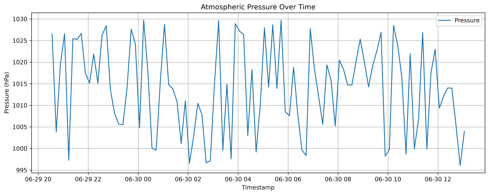
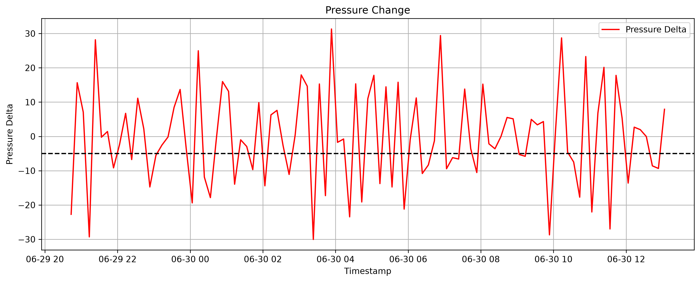
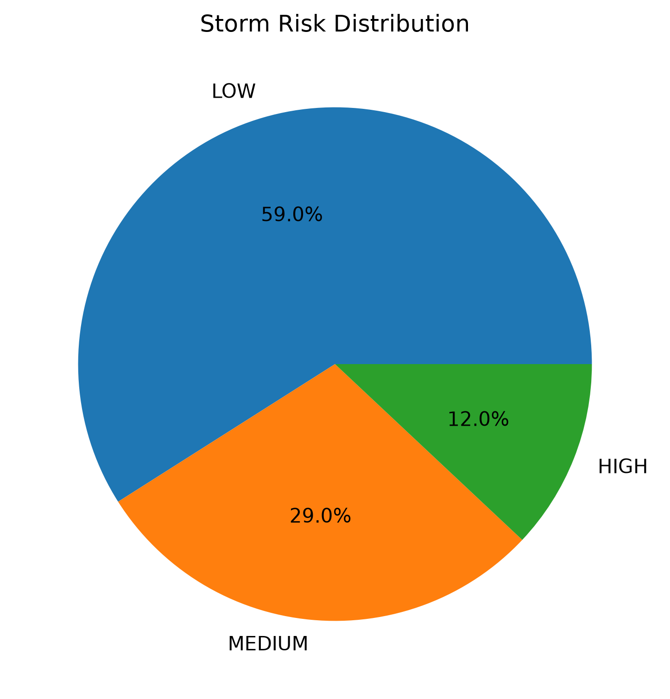

# Pressure Drop Detection and Storm-Risk Expert System

Projekt z przedmiotu **Autonomous Expert Systems and Data Exploration**.

Celem projektu jest analiza danych pogodowych pobieranych z REST API oraz wykrywanie sytuacji, w których może wystąpić podwyższone ryzyko burzowe lub pogorszenie warunków atmosferycznych. System opiera się na analizie spadków ciśnienia atmosferycznego oraz dodatkowych parametrów pogodowych, takich jak prędkość wiatru, opad deszczu i zachmurzenie.

---

## Temat projektu

**Project - Pressure Drop Detection and Storm-Risk Expert System**

Projekt polega na wykrywaniu spadków ciśnienia atmosferycznego i ocenie ryzyka burzowego za pomocą prostego systemu eksperckiego. Program analizuje dane pogodowe, oblicza zmiany ciśnienia, wyznacza punktowy wynik ryzyka i klasyfikuje pomiary do jednej z trzech kategorii:

- `LOW` - niskie ryzyko,
- `MEDIUM` - średnie ryzyko,
- `HIGH` - wysokie ryzyko.

---

## Źródło danych

Dane są pobierane z udostępnionego Weather REST API.

W projekcie wykorzystano endpoint:

```text
GET /weather/batch
```

Przykładowe parametry:

```text
station_id=GDN_01
limit=100
```

---

## Architektura rozwiązania

Projekt realizuje prosty pipeline przetwarzania danych:

```text
Weather REST API
        ↓
Raw data storage
        ↓
Data validation and cleaning
        ↓
Pressure trend analysis
        ↓
Expert system scoring
        ↓
Storm risk classification
        ↓
Alert log + processed output files
        ↓
Charts and statistics
```

---

## Struktura projektu

Proponowana struktura repozytorium:

```text
.
├── WeatherProject.ipynb
├── README.md
├── requirements.txt
├── raw_data/
├── processed/
└── plots/
```

Opis folderów:

```text
raw_data/      - surowe dane pobrane z API w formacie JSON
processed/     - dane przetworzone w formatach Parquet i CSV
plots/         - folder przeznaczony na wykresy
```

---

## Wykorzystane technologie

Projekt został wykonany w języku Python z użyciem następujących bibliotek:

* `requests` - pobieranie danych z REST API,
* `pandas` - tworzenie pomocniczego DataFrame,
* `pyspark` - przetwarzanie danych i analiza,
* `matplotlib` - wizualizacja wyników,
* `json` - zapis danych surowych,
* `os` - tworzenie folderów projektu,
* `datetime` - generowanie nazw plików z datą i godziną.

---

## Instalacja

Najpierw należy sklonować repozytorium:

```bash
git clone <adres_repozytorium>
cd <nazwa_repozytorium>
```

Następnie warto utworzyć środowisko wirtualne:

```bash
python -m venv venv
```

Aktywacja środowiska na Windows:

```bash
venv\Scripts\activate
```

Aktywacja środowiska na Linux/macOS:

```bash
source venv/bin/activate
```

Instalacja wymaganych bibliotek:

```bash
pip install -r requirements.txt
```

---

## Wymagania systemowe

Do uruchomienia projektu wymagane są:

* Python 3.10 lub nowszy,
* Java JDK 8, 11 lub 17,
* PySpark,
* Jupyter Notebook albo JupyterLab,
* dostęp do internetu w celu pobrania danych z API.

PySpark wymaga zainstalowanej Javy.

---

## Opis działania programu

### 1. Inicjalizacja projektu

Na początku program importuje wymagane biblioteki, tworzy sesję Spark oraz przygotowuje konfigurację API. Ustawiane są między innymi:

```text
TOKEN
BASE_URL
HEADERS
STATION_ID
LIMIT
```

Program tworzy także foldery:

```text
raw_data
processed
plots
```

---

### 2. Pobieranie danych z API

Program wysyła zapytanie `GET` do endpointu `/weather/batch`, pobierając pomiary pogodowe dla wybranej stacji. Następnie sprawdzany jest status odpowiedzi API, a dane są konwertowane do formatu JSON.

Pobrane dane są zapisywane w folderze `raw_data` jako plik `.json`. Nazwa pliku zawiera aktualną datę i godzinę, dzięki czemu kolejne uruchomienia programu nie nadpisują wcześniejszych danych surowych.

---

### 3. Utworzenie DataFrame

Dane JSON są zamieniane najpierw na DataFrame biblioteki pandas, a następnie na DataFrame PySpark. Dzięki temu dalsze operacje mogą być wykonywane przy użyciu narzędzi Sparka.

Program wyświetla:

* schemat danych,
* pierwsze rekordy,
* liczbę pobranych pomiarów.

---

### 4. Walidacja i czyszczenie danych

W tym etapie program usuwa duplikaty oraz rekordy z brakującymi wartościami w najważniejszych kolumnach:

```text
timestamp
pressure
wind_speed
rain_mm
cloud_cover
```

Kolumna `timestamp` jest konwertowana na typ daty i czasu. Rekordy z niepoprawnym czasem są usuwane z dalszej analizy.

---

### 5. Analiza trendu ciśnienia

Program sortuje dane według czasu i oblicza zmianę ciśnienia między kolejnymi pomiarami:

```text
pressure_delta = current pressure - previous pressure
```

Jeżeli `pressure_delta` jest ujemne, oznacza to spadek ciśnienia.

Dodatkowo obliczana jest średnia krocząca ciśnienia z aktualnego i czterech poprzednich pomiarów. Pozwala to sprawdzić, czy aktualne ciśnienie jest niższe od niedawnego trendu.

---

### 6. System ekspercki

System ekspercki tworzy kolumnę `score`, czyli punktowy wynik ryzyka. Na początku wynik jest równy 0, a następnie program dodaje punkty za niekorzystne warunki pogodowe.

Punkty są przyznawane za:

* szybki spadek ciśnienia,
* ciśnienie niższe od średniej kroczącej,
* silny wiatr,
* opad deszczu,
* wysokie zachmurzenie.

Program zawiera także reguły łączone. Dodatkowe punkty są dodawane, gdy kilka niekorzystnych warunków występuje jednocześnie, na przykład spadek ciśnienia razem z silnym wiatrem, deszczem lub dużym zachmurzeniem.

---

### 7. Klasyfikacja ryzyka

Po obliczeniu końcowego wyniku `score` program przypisuje każdemu pomiarowi jedną z trzech klas:

```text
score >= 11  → HIGH
score >= 6   → MEDIUM
score < 6    → LOW
```

Znaczenie klas:

```text
LOW     - stabilne warunki pogodowe
MEDIUM  - kilka sygnałów ostrzegawczych
HIGH    - wiele silnych wskaźników niestabilnej pogody
```

---

### 8. Alert log

Program tworzy osobną tabelę alertów. Do tej tabeli trafiają tylko rekordy sklasyfikowane jako `HIGH`.

Każdy alert zawiera między innymi:

* `alert_id`,
* `generated_at`,
* `timestamp`,
* `pressure`,
* `pressure_delta`,
* `wind_speed`,
* `rain_mm`,
* `cloud_cover`,
* `score`,
* `storm_risk`.

---

### 9. Zapis wyników

Program zapisuje przetworzone dane do folderu `processed`.

Tworzone są następujące wyniki:

```text
processed/weather_curated.parquet
processed/weather_processed_csv/
processed/storm_alerts_csv/
```

Plik Parquet zawiera pełny przetworzony zbiór danych. Folder `weather_processed_csv` zawiera dane w formacie CSV. Folder `storm_alerts_csv` zawiera tylko alerty wysokiego ryzyka.

---

### 10. Statystyki i wizualizacja

Program wyświetla podstawowe statystyki:

* liczbę pomiarów,
* liczbę przypadków `LOW`, `MEDIUM` i `HIGH`,
* liczbę alertów wysokiego ryzyka,
* pojedynczy przypadek z najwyższym wynikiem ryzyka.

W notebooku generowane są także wykresy:

* ciśnienie atmosferyczne w czasie,
* zmiana ciśnienia `pressure_delta`,
* wynik ryzyka `score`,
* udział klas `LOW`, `MEDIUM` i `HIGH`.

---

## Wyniki projektu

Po uruchomieniu programu otrzymujemy:

* zapis surowych danych z API,
* oczyszczony i przetworzony zbiór danych,
* obliczone zmiany ciśnienia,
* punktową ocenę ryzyka,
* klasyfikację `LOW`, `MEDIUM`, `HIGH`,
* tabelę alertów wysokiego ryzyka,
* wykresy przedstawiające wyniki analizy.

---

---

# Przykładowe wyniki

Poniżej przedstawiono przykładowe wyniki działania programu.

## Surowe dane (Raw Data)

Pierwsze rekordy pobrane z REST API.

### Przykładowe surowe dane (Raw Data)

| Timestamp | Station | Temp. [°C] | Humidity [%] | Pressure [hPa] | Wind [m/s] | Rain [mm] | Clouds [%] |
|-----------|---------|-----------:|-------------:|---------------:|-----------:|----------:|-----------:|
| 2026-06-29 09:29 | GDN_01 | 14.17 | 67.30 | 1011.29 | 12.68 | 2.53 | 58 |
| 2026-06-29 09:19 | GDN_01 | 15.90 | 54.35 | 1007.36 | 6.46 | 3.27 | 47 |
| 2026-06-29 09:09 | GDN_01 | 18.45 | 58.87 | 1012.49 | 4.99 | 1.06 | 45 |
| 2026-06-29 08:59 | GDN_01 | 16.97 | 93.70 | 1022.12 | 13.82 | 0.00 | 31 |
| 2026-06-29 08:49 | GDN_01 | 17.75 | 63.19 | 1006.01 | 1.50 | 1.79 | 42 |

---

## Dane przetworzone (Processed Dataset)

Po wykonaniu walidacji oraz obliczeniu zmian ciśnienia.

### Pressure Trend Analysis

| Timestamp | Pressure [hPa] | Pressure Δ [hPa] | Rolling Avg [hPa] |
|-----------|---------------:|-----------------:|------------------:|
| 2026-06-28 16:59 | 1014.40 | – | 1014.40 |
| 2026-06-28 17:09 | 998.79 | -15.61 | 1006.60 |
| 2026-06-28 17:19 | 1000.36 | +1.57 | 1004.52 |
| 2026-06-28 17:29 | 1019.30 | +18.94 | 1008.21 |
| 2026-06-28 17:39 | 1019.79 | +0.49 | 1010.53 |
| 2026-06-28 17:49 | 1005.97 | -13.82 | 1008.84 |
| 2026-06-28 17:59 | 1000.72 | -5.25 | 1009.23 |
| 2026-06-28 18:09 | 1003.87 | +3.15 | 1009.93 |
| 2026-06-28 18:19 | 1027.35 | +23.48 | 1011.54 |
| 2026-06-28 18:29 | 1028.26 | +0.91 | 1013.23 |

---

## Alert Log

Rekordy zakwalifikowane jako **HIGH**.

### Alert Log (HIGH Risk Cases)

| Alert ID | Timestamp | Pressure [hPa] | Pressure Δ [hPa] | Wind [m/s] | Rain [mm] | Clouds [%] | Score | Risk |
|---------:|-----------|---------------:|-----------------:|-----------:|----------:|-----------:|------:|:----:|
| 1 | 2026-06-28 18:39 | 996.33 | -31.93 | 12.45 | 0.00 | 65 | 11 | HIGH |
| 2 | 2026-06-28 18:49 | 1021.11 | +24.78 | 13.40 | 2.62 | 96 | 11 | HIGH |
| 3 | 2026-06-28 19:49 | 1003.23 | -21.28 | 11.96 | 0.86 | 12 | 11 | HIGH |
| 4 | 2026-06-28 20:19 | 1005.27 | -19.41 | 12.19 | 0.00 | 67 | 11 | HIGH |
| 5 | 2026-06-28 20:59 | 1005.36 | -24.41 | 9.96 | 1.16 | 46 | 12 | HIGH |
| 6 | 2026-06-28 21:39 | 1001.16 | -23.41 | 8.47 | 0.38 | 47 | 11 | HIGH |

---

# Wizualizacja wyników

## Wykres ciśnienia atmosferycznego



---

## Wykres zmian ciśnienia



---

## Rozkład klas ryzyka



---


## Najważniejsze kolumny wynikowe

| Kolumna            | Opis                                                     |
| ------------------ | -------------------------------------------------------- |
| `timestamp`        | czas pomiaru                                             |
| `pressure`         | ciśnienie atmosferyczne                                  |
| `pressure_delta`   | różnica między aktualnym a poprzednim pomiarem ciśnienia |
| `pressure_rolling` | średnia krocząca ciśnienia                               |
| `wind_speed`       | prędkość wiatru                                          |
| `rain_mm`          | opad deszczu                                             |
| `cloud_cover`      | zachmurzenie                                             |
| `score`            | punktowy wynik ryzyka                                    |
| `storm_risk`       | końcowa klasa ryzyka: `LOW`, `MEDIUM` albo `HIGH`        |

---

---

## Podsumowanie

Projekt realizuje kompletny proces analizy danych pogodowych: od pobrania pomiarów z REST API, przez zapis danych surowych, oczyszczenie i przetworzenie danych, aż po ocenę ryzyka pogodowego oraz zapis alertów. Najważniejszym elementem rozwiązania jest system ekspercki, który na podstawie spadku ciśnienia, prędkości wiatru, opadu deszczu i zachmurzenia wyznacza poziom ryzyka burzowego.

Zastosowane reguły pozwalają w prosty i czytelny sposób klasyfikować warunki pogodowe jako `LOW`, `MEDIUM` lub `HIGH`. Dzięki temu możliwe jest szybkie wykrycie sytuacji, w których kilka niekorzystnych czynników występuje jednocześnie, na przykład spadek ciśnienia połączony z silnym wiatrem, opadem i dużym zachmurzeniem.

Wnioskiem z projektu jest to, że nawet prosty system oparty na regułach może być użyteczny do wstępnej oceny ryzyka pogodowego. Rozwiązanie jest przejrzyste, łatwe do modyfikacji i może zostać rozbudowane o kolejne stacje pomiarowe, automatyczne uruchamianie, powiadomienia o alertach lub dokładniejszą analizę historycznych trendów pogodowych.